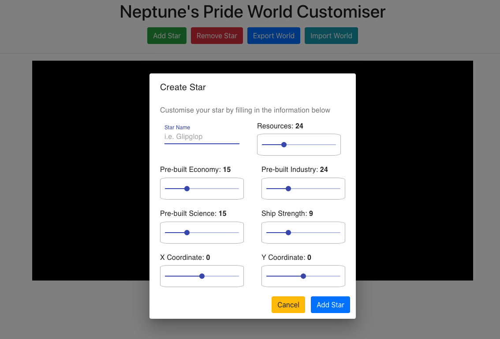
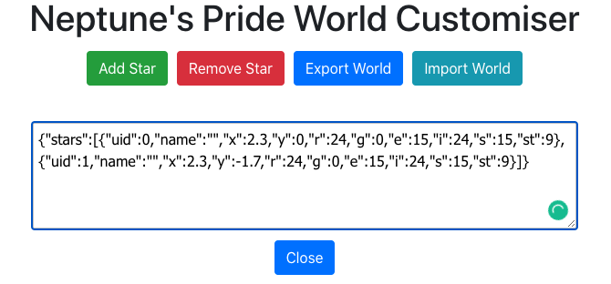
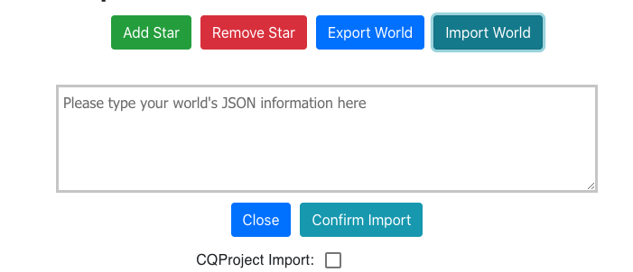
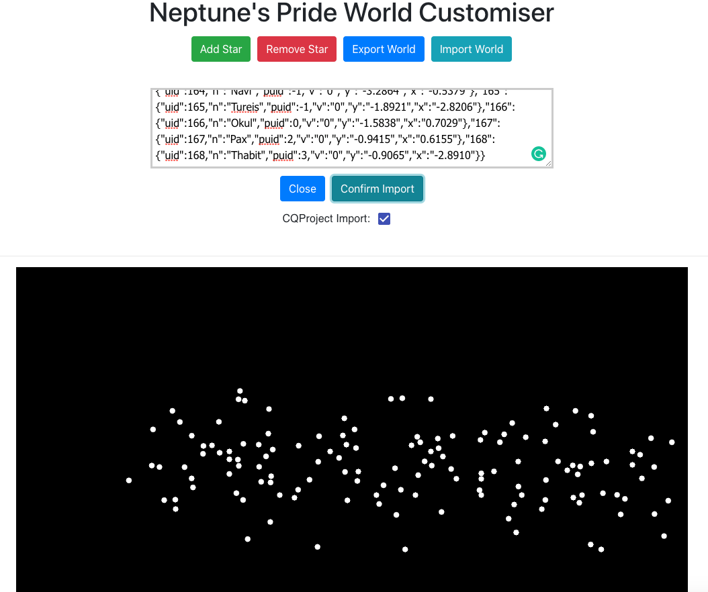

# Neptune's Pride World Generator / Customiser
Neptune's Pride is an intense strategy game revolving around building your civilisation in space and taking down other players. This React application can create and customise your worlds for you if you're bold enough to make your own!

### Features
- Adding/Removing Stars, customising their:
  - Economy, Industry, Science
  - Natural Resources
  - Location
  - Name

- Exporting your worlds into a JSON script to use in Proteus worlds

- Import your worlds directly from the game or from the CQ Api

- Visualisation of what your world will look like

### Adding Stars
Either clicking on the visualiser or the add button will bring up the add stars screen

### Exporting Stars
For when it's time to start using your new world

### Importing a system
If you already have a JSON script ready to go, all you have to do is import it

### Final Star System Example

